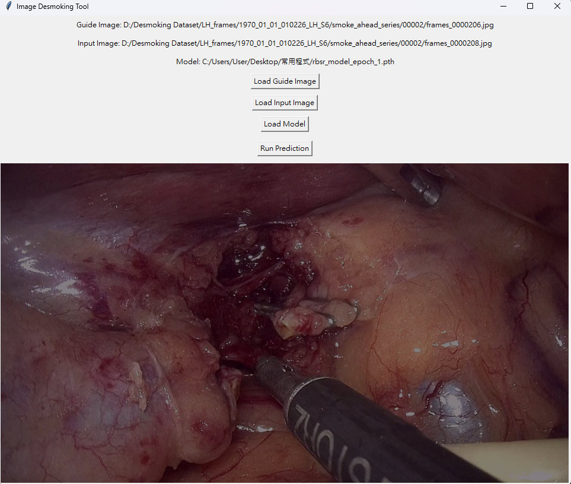

# Self-supervised-Desmoker
# 🚀 Update
02/26: ```infer_v2.py``` now includes a feature that allows users to directly select images for import and specify the save location for masks with just a few simple clicks.
# Desmoking for laparoscopic images
This project builds on [SelfSVD](https://github.com/ZcsrenlongZ/SelfSVD) by ZcsrenlongZ, but not using mmcv and related library

## How to inferring
```bash
cd Self-supervised-Desmoker
python infer.py
```
## How to train
```bash
cd Self-supervised-Desmoker
python train.py
```
